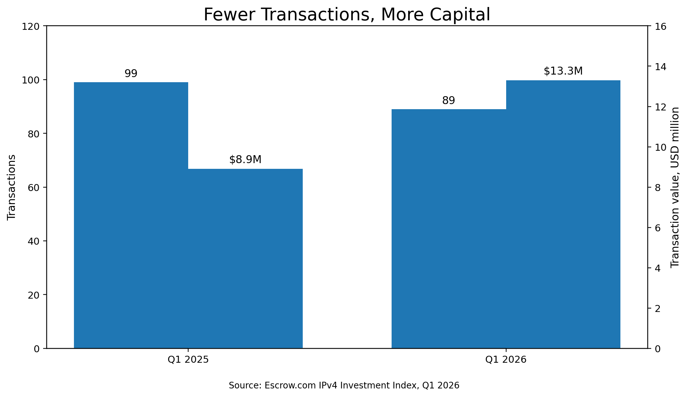
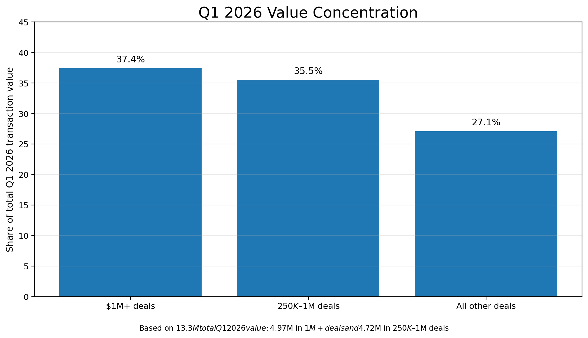
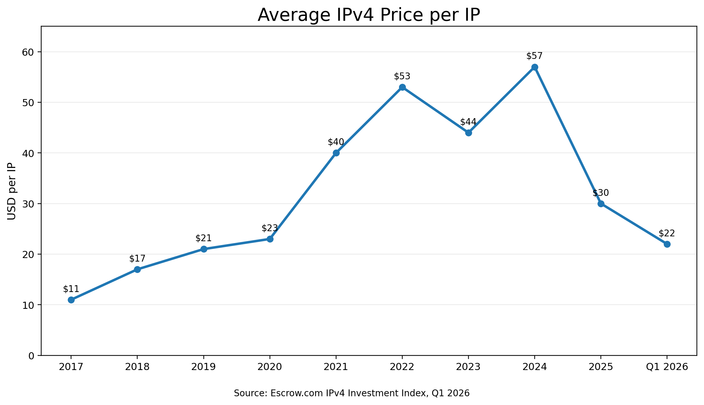
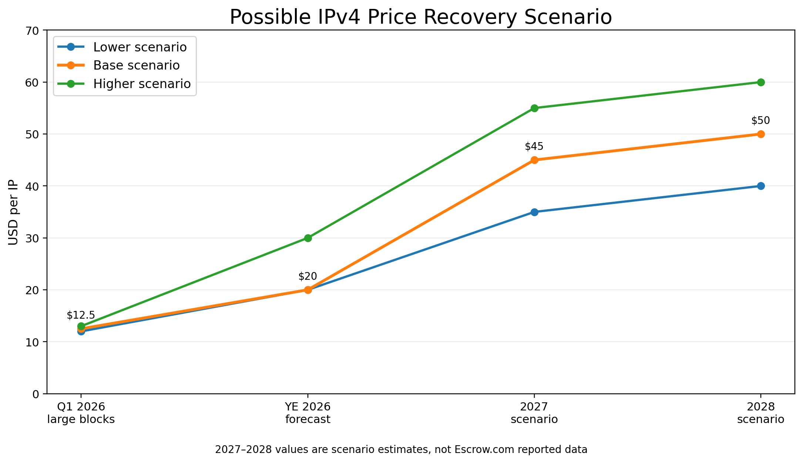

The IPv4 market is sending mixed signals in 2026, and the latest transaction data tells a story that most sellers are missing.

At first glance, many sellers see only one thing: prices are lower than they were during the peak years. Listings are taking longer to sell, buyers are negotiating harder, and competition among sellers has intensified.

Yet the latest [Escrow.com](https://www.escrow.com) IPv4 Investment Index reveals a very different story beneath the surface.

In Q1 2025, Escrow.com facilitated 99 IPv4 transactions worth approximately $8.9 million. In Q1 2026, the platform recorded only 89 transactions—fewer deals than the year before—yet total transaction value increased to $13.3 million.

Fewer transactions. More money.

That is one of the clearest signs that the market is shifting from retail-style purchasing toward **institutional accumulation**.

## Buyers Are Not Leaving the Market—They Are Buying Bigger

The most important takeaway from the report is not the decline in transaction count. It is the dramatic increase in average deal size.

While smaller IPv4 holders are focused on falling per-IP prices, larger buyers appear to be taking advantage of current market conditions to acquire significantly larger blocks. Instead of purchasing a /23 and a /22 separately, buyers are increasingly targeting /19, /18, and even /16-sized allocations.

This behavior explains why overall transaction value increased despite fewer completed transfers. The money never left the market. It simply became concentrated in larger acquisitions.

## Fear Is Dominating Seller Sentiment

Anyone active in the IPv4 industry today can see it: there are more sellers than buyers.

Small subnet holders often see prices decline and assume the market is collapsing. As a result, many rush to [sell ip](/sell-ipv4) blocks before prices fall further, creating even more downward pressure on the market.

This becomes a self-reinforcing cycle:

- Prices fall
- Sellers become nervous
- More inventory enters the market
- Buyers gain leverage
- Prices fall again

Meanwhile, large buyers remain patient. They know supply is finite. And they know many sellers are willing to discount heavily simply to exit the market.

## A Look at the Bigger Picture

Historical data shows that **IPv4 pricing** has experienced multiple cycles over the last decade.

While prices have corrected significantly from their peaks, transaction activity remains healthy and demand continues to evolve. The current correction is occurring alongside a notable shift toward larger block acquisitions and infrastructure-driven demand.

## The AI Effect Is Just Beginning

According to Escrow.com's report, average deal size increased significantly in Q1 2026 as demand for large IPv4 blocks accelerated.

A major driver behind this trend is the rise of agentic AI systems—autonomous services, AI agents, and infrastructure platforms operating at scale.

The report estimates that approximately 522,000 IPv4 addresses changed hands in Q1 2026 alone, putting the market on pace for its busiest year since 2020.

Large-block pricing has already risen from roughly $8–$10 per IP to $12–$13 per IP in a matter of weeks. Industry brokers interviewed in the report expect large-block pricing to potentially reach $20 per IP before the end of the year.

Whether those forecasts prove accurate or not, one reality remains unchanged: AI infrastructure requires network resources. And IPv4 remains one of the scarcest digital assets on the internet.

## Why Today's Weakness May Create Tomorrow's Shortage

What many market participants overlook is that falling prices do not create new IPv4 addresses. Every /24 sold today still disappears into the same finite global supply.

As small holders continue liquidating inventory, ownership becomes increasingly concentrated among larger operators, cloud providers, infrastructure companies, and long-term investors. Eventually, the pool of willing sellers shrinks.

Historically, this has been the catalyst for major upward price movements.

The current environment looks less like a market collapse and more like a redistribution phase:

- Weak hands are exiting
- Strategic buyers are accumulating
- AI demand is accelerating
- Supply remains permanently fixed

*Note: The 2027–2028 figures shown above represent market expectations and scenario estimates, not reported Escrow.com transaction data.*

## My View

The current IPv4 market feels remarkably similar to other asset classes during periods of pessimism. Fear is visible everywhere. Yet transaction value is increasing. Large buyers are accumulating. AI-related demand is accelerating. And the supply of IPv4 addresses remains permanently fixed.

The market may continue to experience volatility throughout 2026. However, when future observers look back at this period, they may see it not as the beginning of a decline, but as the phase when institutional buyers quietly accumulated some of the internet's most valuable digital infrastructure.

Whether you're looking to [buy ip](/buy-ipv4) blocks, [sell ip](/sell-ipv4) addresses, or [lease ip](/lease-ipv4) space, understanding these market dynamics can help you make better decisions.

---

Source: https://ipv4center.com
